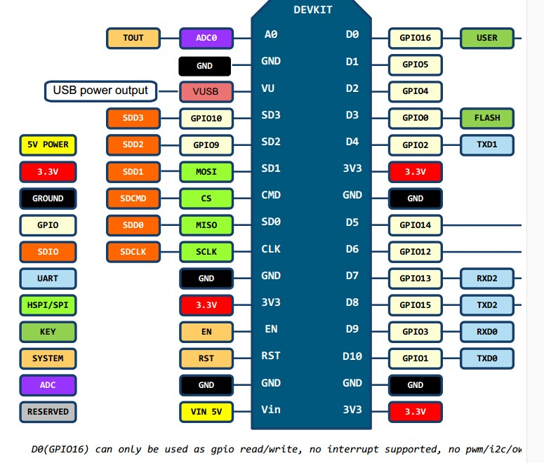
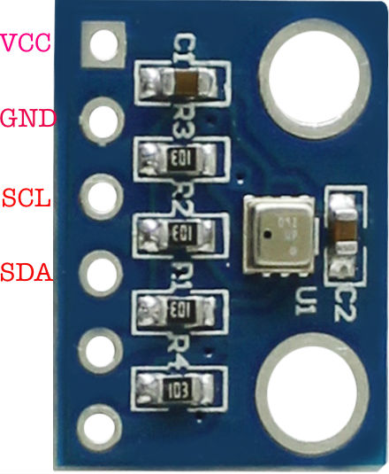

## 使用nodemcu+BME280 采集温湿度和气压信息, 并通过wifi发送

特点：

* 灵活，简单写lua程序
* 支持mqtt、http、aprs发送，发送时LED灯亮0.5s
* 支持现场配置，运行状态时按FLASH键，下次RST后进入配置模式
* 在配置模式(LED闪烁)，按FLASH键，会删除所有配置，下次RST写入默认配置并进入配置模式
* 支持远程更新。发送 update 到 /cmd/chipid，进入更新模式，发送 restart 重启，发送 文件名 文件长度 更新

购买链接：

* [ESP8266 Lua WIFI V3](https://item.taobao.com/item.htm?id=531755241333) 15.40元
* [USB 线](https://item.taobao.com/item.htm?id=557156308010) 1.70元
* [BME280](https://item.taobao.com/item.htm?id=541618585092) 16.50元

外加USB电源就可以工作。

连线图：

```
BME280模块       ESP8266模块
       VCC  -->  电源 注意是3.3v模块
       GND  -->  GND
       SCL  -->  D5 (GPIO14)
       SDA  -->  D6 (GPIO12)
```


 

步骤：

1. 安装esptool.py

   请参考 https://github.com/espressif/esptool 安装esptool.py

2. 将ESP8266 板子通过USB线连接PC，安装USB驱动，查看得知串口是COM3

3. 执行如下命令，如果能看到芯片类型，说明串口工作正常

   `esptool.py --port COM3 chip_id`

4. 执行如下命令刷新flash

   `esptool.py --port COM3 write_flash 0 nodemcu-master-11-modules-2018-10-25-00-33-21-float.bin`

   说明：nodemcu-master-11-modules-2018-10-25-00-33-21-float.bin 由 https://nodemcu-build.com/ 生成，选择的模块有`bme280 file gpio http i2c mqtt net rtctime sjson sntp tmr uart wifi` 。

5. 安装ESPlorer

   请参考 https://esp8266.ru/esplorer/ 安装

6. 打开ESPlorer

   选择COM3，115200，open

   按8266板子USB一侧的RST按钮，能看到“Formatting file system. Please wait..."，等结束。

7. 写入程序

   依次打开 bme280.lua init.lua setup.lua 三个文件上传到ESP8266

8. 配置

   如果启动时 config.lua 不存在，会生成默认配置，默认配置SSID为ustcnet，通过MQTT发送至 202.141.176.2，并进入配置模式。

   也可以在运行时，按 FLASH 键，下次启动将进入配置模式。

   在配置模式，可以用手机等终端，连接 "ESP8266" SSID，访问 http://192.168.0.1 ，修改配置后单击 "save" 保存。

   也可以把config.lua文件下载回来修改后再上传。

